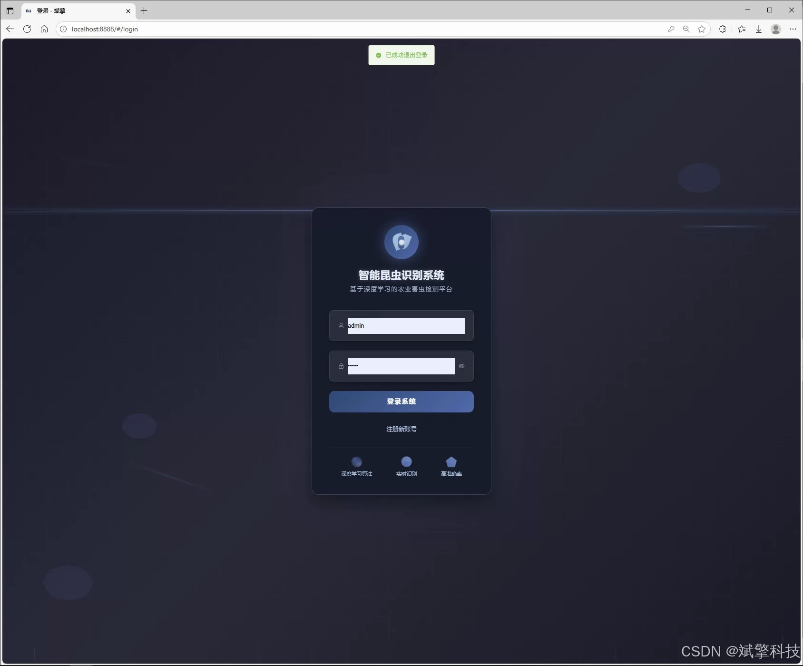
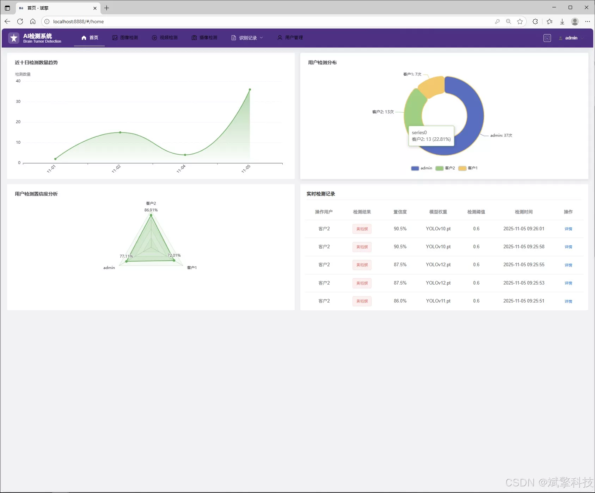
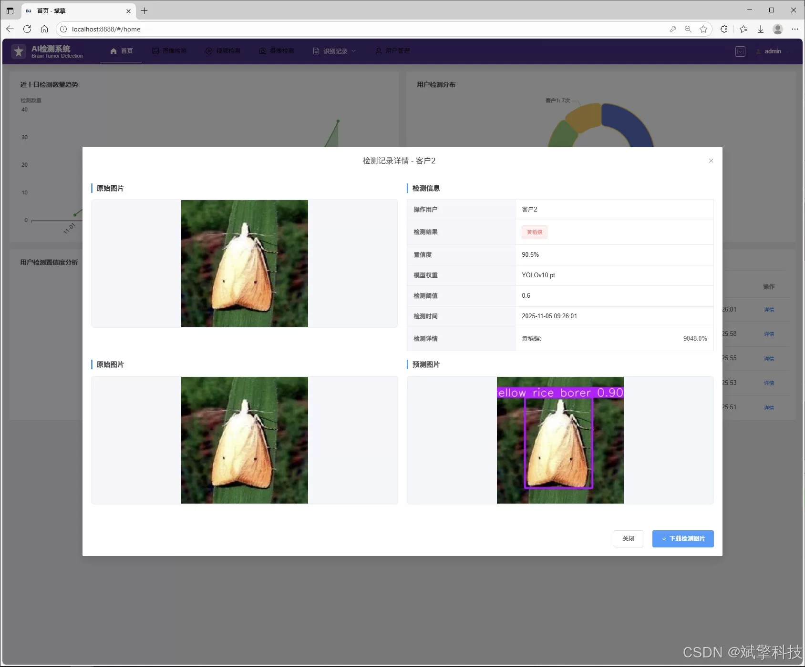
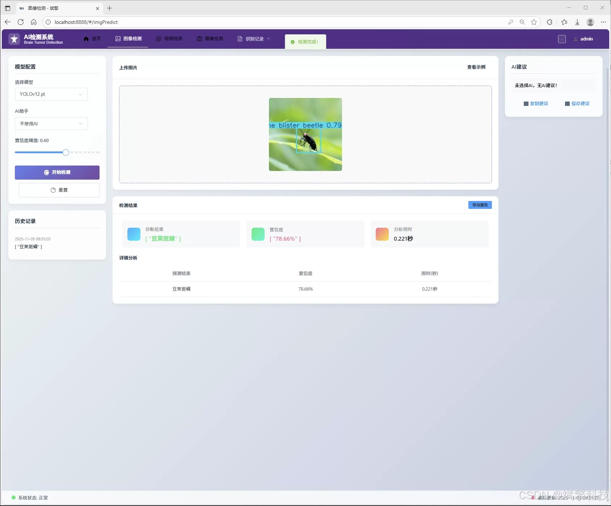
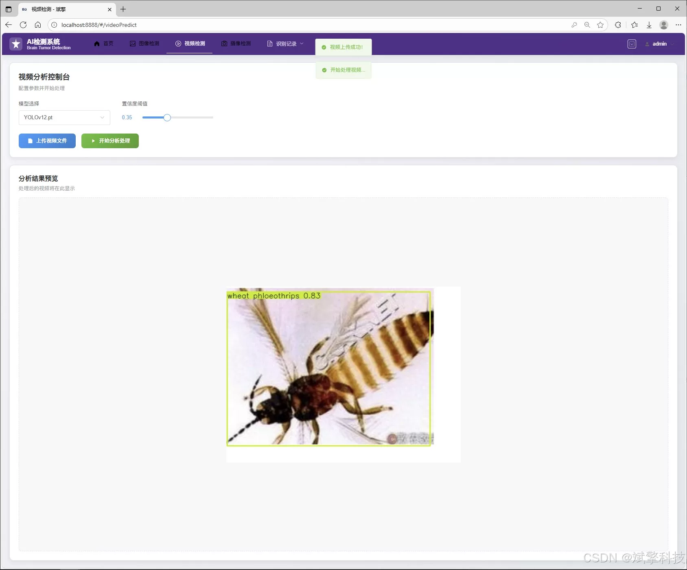
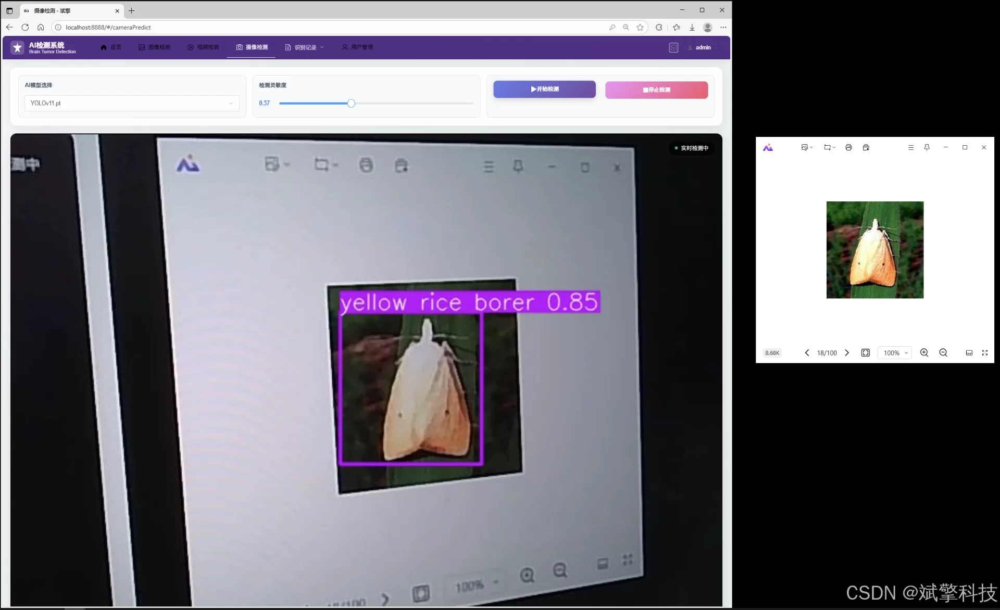
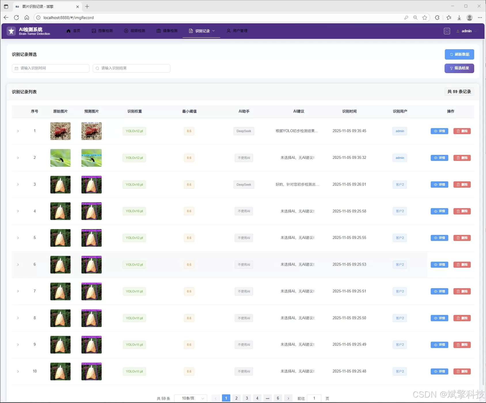
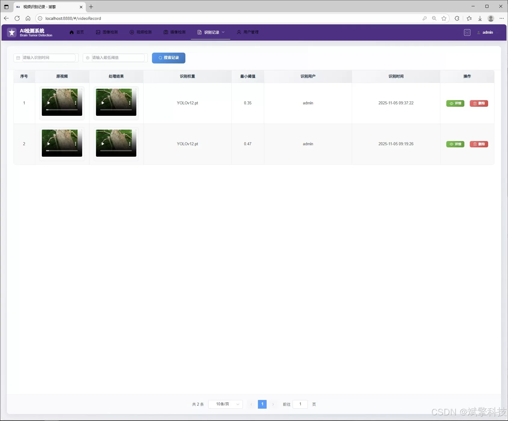

# Insect identification based on YOLO deep learning and the large models of Qianwen and DeepSeek

## Body

Based on YOLO deep learning and the large models of Qianwen, DeepSeek insect recognition detection system (DeepSeek intelligent analysis + web interface + front-end separation + YOLO data + YOLOv8/YOLOv10/YOLOv11/YOLOv12)

With the rapid development of precision agriculture and smart plant protection, using computer vision technology to quickly and accurately identify and monitor crop diseases and pests has become an important research direction in modern agricultural informatization. Insects, as key biological factors affecting the healthy growth of crops, their early discovery and species identification are of great significance for effectively implementing prevention measures, reducing the misuse of pesticides, and ensuring food security. However, traditional manual field survey methods have limitations such as low efficiency, strong subjectivity, and high requirements for professional knowledge.

To solve these problems, we designed and developed this "Insect Recognition and Detection System based on YOLOv8/v10/v11/v12 and SpringBoot". This system integrates cutting-edge deep learning object detection technology with modern Web development frameworks, aiming to provide users with an efficient, accurate, user-friendly, and feature-rich intelligent insect recognition and analysis platform.

The core of the system uses a series of advanced YOLO models (covering YOLOv8 to the latest YOLOv12), ensuring the detection algorithm's cutting-edge accuracy and speed. At the same time, we innovatively integrate the AI analysis capabilities of the DeepSeek big language model, allowing the system not only to "identify" insects but also to "understand" and "interpret" the results, providing professional analysis insights. Through the back-end API built with SpringBoot and the responsive front-end interface, the system realizes full functionality including user management, multimodal detection (images, videos, real-time cameras), data visualization, and record management, providing a powerful digital tool for agricultural technicians, researchers, and farmers.

Functional modules

✅ Information visualization, data visualization.

✅ Image detection supported by AI analysis functions, DeepSeek and Qianwen.

✅ Support for image detection, video detection, and real-time camera detection, with detection results saved to MySQL database.

✅ Image recognition record management, video recognition record management, and camera recognition record management.

✅ User management module, where administrators can add, delete, update, and view users.

✅ Personal center, where users can modify their information, password, name, profile picture, etc.

## Images

## Payment

Here is a pay link on Stripe ( https://buy.stripe.com/3cs8yP7sY87d0vu9AB ). Please contact me lonlonago@foxmail.com after funding $89, and I will send you a complete data files , thank you!

